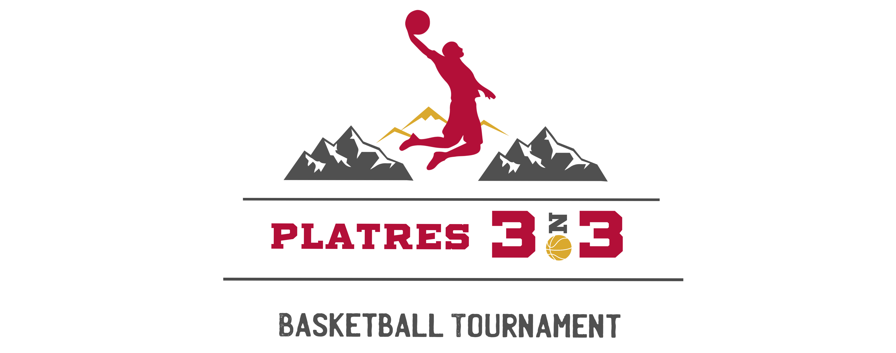

<!DOCTYPE html>
<html lang="el">
<head>
    <meta charset="UTF-8">
    <meta name="viewport" content="width=device-width, initial-scale=1.0">
    <title>Platres 3on3 Basketball Tournament</title>
    
</head>
<body>
    
    

        <h1>Platres 3on3 Basketball Tournament</h1>
        <ul>
            <li>Date: 2 June 2024</li>
            <li>Location: <a href="https://platresarena.com/">Platres Arena</a>, Platres.</li>
        </ul>
        

            After a successful year, Platres 3on3 returns to the Panos Platres basketball court for another event, with the main goal of supporting the Little Heroes Foundation and Europa Donna Cyprus, two non-profit organizations that provide assistance and support to children battling leukemia, and to women and men fighting breast cancer.
        

        <!-- Add more English content here -->
    

    

        <h1>Τουρνουά Μπάσκετ 3on3 Platres</h1>
        <ul>
            <li>Ημερομηνία: 2 Ιουνίου 2024</li>
            <li>Τοποθεσία: <a href="https://platresarena.com/">Αρένα Πλάτρες</a>, Πλάτρες.</li>
        </ul>
        

            Μετά από μια επιτυχημένη χρονιά, το Platres 3on3 επιστρέφει στο γήπεδο των Πάνω Πλατρών για μια ακόμη διοργάνωση, με κύριο στόχο την υποστήριξη του Ιδρύματος Μικροί Ήρωες και του Europa Donna Cyprus, δύο μη κερδοσκοπικών οργανισμών οι οποίοι παρέχουν βοήθεια και στήριξη σε παιδιά τα οποία παλεύουν με την λευχαιμία, σε γυναίκες και άντρες οι οποίοι αγωνίζονται κατά του καρκίνου του μαστού.
        

        <!-- Add more Greek content here -->
    

    

        <button onclick="showEnglishContent()">English</button>
        <button onclick="showGreekContent()">Ελληνικά</button>
    

    
</body>
</html>
